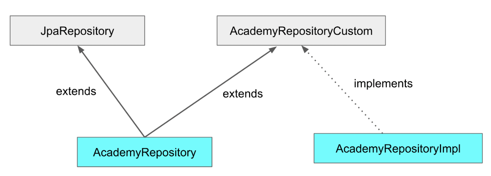
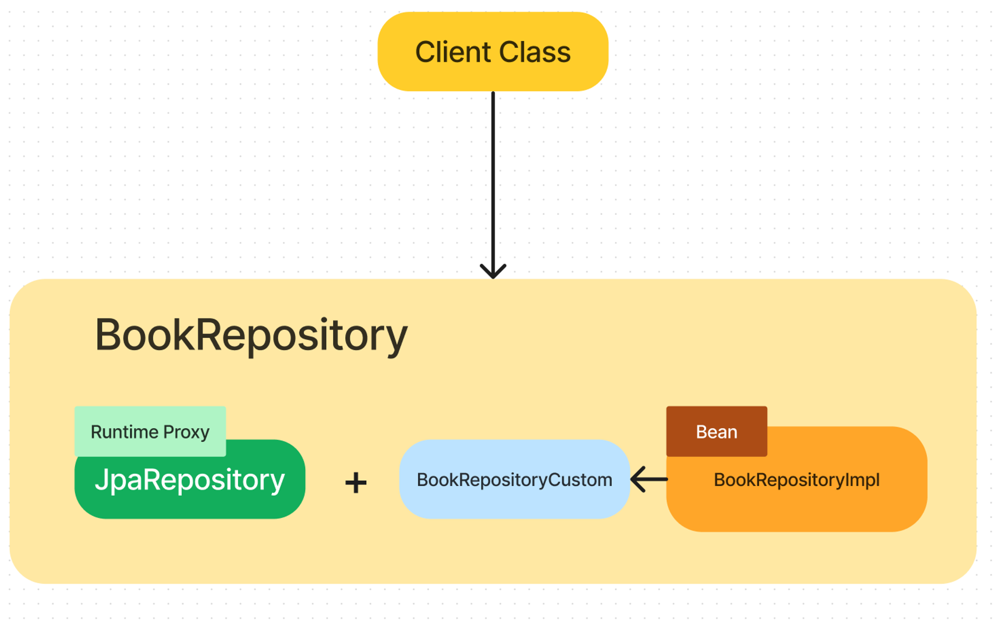

# pioneerkids
피오니키즈 프로젝트
-------------


## 개발기간
***
~ 2023.12.03


## 개발환경
***
 - java : 17 (jdk 17)
 - OS : windows / mac
 - language : java
 - framework : spring, spring-data-jpa
 - spring Version : 2.7.17
 - server : spring boot
 - database : postgresql 11.0
 - web : thymeleaf , bootstrap , jQuery , html5
  
## 멤버구성
***
- 안성기 : 전체적인 기능 개발 및 관리.
- 이은희 : 게시판 관련 개발담당. (~11/24)

## 개발 관련 메모 
***
하단에 필요한 내용 계속 추가하겠음. 

*************
<details>
<summary> 프로젝트 setting 관련</summary>

<!-- summary 아래 한칸 공백 두어야함 -->

####  프로젝트 setting 관련
 - eclipse , intellij 모두 실행 가능
 - eclipse 에서는 string boot 로 설정 해야함.  (https://diary-developer.tistory.com/9 )
 - eclipse 롬복 설치 진행 필요 (미설치시 프로젝트 에러 발생 : https://congsong.tistory.com/31 )

</details>


<details>

*************
<summary>
DB 관련 정보
</summary>

<!-- summary 아래 한칸 공백 두어야함 -->

#### DB 정보
Host : db.jjeovi.gabia.io
IP : 211.47.74.33
Port : 5432
Database : dbjjeovi

Username : jjeovi
password : ponkids2023!

DB phpPgAdmin : http://db.jjeovi.gabia.io/pgadmin/?_gl=1*15jm1ly*_ga*ODI1NTQ5MzYuMTY5MTk3MTUzMA..*_ga_C1WCKH1K26*MTY5Nzc3MjU3NC4xNC4xLjE2OTc3NzI5MjkuMjAuMC4w


데이터베이스 명 : dbjjeovi


계정 / 비밀번호 : ponkids / ponkids2023!
스키마 : ponkids 
개발 스키마 : ponkids_dev (개발용으로 우선 작업  ponkids 스키마는 추후 운영에서 사용 예정... ) 
</details>


<details>

<summary> 공통소스 관리 가이드</summary>

<!-- summary 아래 한칸 공백 두어야함 -->

*************
#### 공통소스 관리 가이드
 - 공통적으로 사용하는 js,css 내용을 공통소스로 통합시키기 위함
 - 공통소스 경로 : resources/static/common/*
 - 현재기준 js, css 2가지 파일을 공통소스로 사용중
 - 이과장님은 공통소스에 내용추가시 common_eh.css , common_eh.js 파일로 작업해주시면 제가 확인 후 머지하겠습니다.
 
*************
</details>


<details>

<summary> 231113 : DB 접속시 '[name]롤의 최대 동시 접속수를 초과했습니다' 증상 시. (조치방법. 원인분석중..)</summary>

<!-- summary 아래 한칸 공백 두어야함 -->

*************
#### 231113 : DB 접속시 '[name]롤의 최대 동시 접속수를 초과했습니다' 증상 시. (조치방법. 원인분석중..)
 - 현재 가비아 DB서버 사용중. DB서버의 동시세션 개수는 30개
 - 유휴상태인 세션이 계속 서버상에 올라오는데, 이 개수들이 30개가 차면서, 해당 증상이 뜨는 것으로 확인.
 - 유휴 상태인 세션이 뜨는 원인은 분석중입니다.
 - 해결책으로는, 유휴상태세션을 강제로 종료시키는 방법이 있습니다.

 - 
-- 1.해당 쿼리를 날려 pid값을 확인 해놓음. (위에서부터 차례로)
   
-- 현재 유휴 세션 조회. state = idle  

select pid,application_name, client_addr, client_port, backend_start, query_start, state, query, backend_type  from pg_catalog.pg_stat_activity   
where datname = 'dbjjeovi'
and state = 'idle'
order by backend_start asc;


-- 2. 1에서 확인한 pid 값을 대입시켜 세션을 강제종료 ex : SELECT pg_terminate_backend('177283');  

-- 세션 종료 명령어  

SELECT pg_terminate_backend(pid);  


 - 추가적으로 원인파악이되면 조치를 취하겠습니다.!!
 
*************
</details>


<details>

<summary> 231113 : JPAQueryFactory 에러 발생 시 - build.gradle 우클릭 하여 Gradle - Refresh Gradle Project 클릭하여 라이브러리 추가작업 필요.</summary> 

<!-- summary 아래 한칸 공백 두어야함 -->

*************
#### 
 - 231113 : JPAQueryFactory 에러 발생 시 - build.gradle 우클릭 하여 Gradle - Refresh Gradle Project 클릭하여 라이브러리 추가작업 필요.
 

*************
</details>


<details>

<summary> JPAQueryFactory 구조 패턴 </summary>

<!-- summary 아래 한칸 공백 두어야함 -->


*************
#### JPAQueryFactory 를 사용하는데 기본패키지 구조를 잡고 가야할 것 같아서,,


 - JPA로만 활용해서 쿼리를 날리기에 어려움이 있는 거 같아서 검색해보니 JPAQueryFactory 를 사용해 쿼리를 커스터마이징 하는 방법이 있다고 해서 그 패턴을 사용하기로 결정했습니다... (다른 방법으로도 쿼리의 복잡성을 해결할 수 있지만, 저희는 JPAQueryFactory를 사용하는것으로..)
 - 해당 JPAQueryFactory의 설치는 build.gradle을 통해서 마쳤고, 구현하는 방법(방식)또한 다양하게 구현할 수 있는데,
   저는 스프링 공식 사이트 에서 추천하는 방식으로 사용을 하려고 합니다. 
   
   *참고 url
 - https://docs.spring.io/spring-data/jpa/docs/2.1.3.RELEASE/reference/html/#repositories.custom-implementations
 - https://velog.io/@soyeon207/QueryDSL-Spring-Boot-%EC%97%90%EC%84%9C-QueryDSL-JPA-%EC%82%AC%EC%9A%A9%ED%95%98%EA%B8%B0
 - https://80000coding.oopy.io/ec8f069c-1953-4b3b-885a-7430f67f3b8f
 
 참고이미지1
 

*************


 참고이미지2
 

 
 - Repository(interface) 가 JpaRepository(interface), CustomRepository(interface)를 다중 상속 받고,
→ CustomRepository 인터페이스에 선언되어 있는 메소드에 대한 구현은 RepositoryImpl 에서 한다.
→ 그리고 사용자는 Repository 인터페이스를 DI 받아서 사용한다.


```text
com.meta.ponkids.domain /
                    │
                    └── {domain} /
                           ├── ...
                           ├── repository /
                           │       │ 
                           │       ├── custom /
                           │       │     └── {domain}RepositoryCustom.java
                           │       ├── impl /
                           │       │     └── {domain}RepositoryImpl.java
                           │       └── {domain}Repository.java
                           └── ..... 
      
   
```

 - 위의 구조로 파일생성 해주시고, 
 - {domain}Repository.java       : JpaRepository 와 RepositoryCustom 을 둘다 상속 받습니다.
 - {domain}RepositoryCustom.java : QueryDSL 로 커스텀해서 사용할 메소드를 선언합니다.
 - {domain}RepositoryImpl.java   : RepositoryCustom interface 에 선언한 메소드를 구현합니다.
 
 - 이때 {domain}RepositoryImpl 파일은 Repository+Impl 의 형식을 반드시 따라주어야 합니다.
 
*************
</details>


<details>

<summary> 231118 : Dto 만들다 보니까,,, </summary> 

<!-- summary 아래 한칸 공백 두어야함 -->

*************
#### 
- 231118 : Dto 만들다 보니까,,,
  너무 dto 에 대한 개발시간이 많아지는거 같고 항목 어떤거 추가하지, 명명은 어떻게 하지 등 생각보다 dto관련해서 생각하는 시간이 많아 지는 것 같아서,,, 끄적여 봅니다. ㅠ ㅠ

제가 초기에 생각한 dto 관리 법(??) 은, 최대한 DTO객체를 구분해서 개발해보자 였습니다.

예를들어, 기능별이나 통신방법 , 등등을 구분해서 DTO객체를 구분해보자 라는 생각으로 시작을 해서, ~SaveReqDto, ~ ListResDto 등등 이것저것 만들어보니까

이렇게 하는게 맞나 싶을 정도로 ( 제가 적응하지 못한 걸 수도 있습니다. ) 개발을 하면 할 수록 불편해지는 것 같다?를 느낍니다.

물론 제가 적응하지 못하는 걸 수도 있는데,  시간적으로 너무 많이 쓰고 있는 부분은 팩트이고, 현실적으로 시간이 없기에,,

제가 내린 생각을 말씀드리고자 합니다. (과장님의 의견도 받으면 좋을 것 같습니다.)

저는 DTO 를 크게

~ListDto  
~SaveDto  
~ModDto  

3가지로 구분을 해보았고,  

~ListDto : /list 에서 사용 . 목록 조회 용  
~SaveDto : /regist, /insert 에서 사용. (/regist) 데이터 저장시 초기에 object생성할 때, (/insert) 생성한 객체를 저장시킬때  
~ModDto : /modify , /update 에서 사용 . ( /modify ) 리스트에서 수정페이지로 넘길 때 , (/update) 수정한 객체 update 시킬때  

이정도로 구분 했어요. Request, response 각각 다 dto를 따로 만들으려니까 dto만드는데  좀 귀찮다는 느낌이 들었어요. 이 부분은 피드백 받아서 베이스를 바꿀 생각도 있긴 해서, 과장님 의견이 있으시면 한번 얘기해주세요. (톡남겨주시거나 여기에 수정?ㅋㅋ)  따로 말씀 없으시면 이렇게 3개 를 기본으로 만들까 합니다. ( ** 예외적으로 발생하는 DTO는 논외에요)  


*************
</details>


<details>

<summary> 231120 : 파일첨부 관련 환결설정 세팅사항</summary> 

<!-- summary 아래 한칸 공백 두어야함 -->

*************
#### 
- 231120 : 파일첨부 관련 환결설정 세팅사항 (변경됨)


 - ponkids/src/main/resources/application.yaml

```
upload:
    path : C:/upload/    # 업로드 파일 저장 경로 ( window )
    #path : /Users/jjeoV/Desktop/jjeoV/2023/pioneerKids/upload/    # 업로드 파일 저장 경로 ( Mac )

```

첨부파일 관련 작업시...  
upload:  
		path : {path} 경로를 본인 local 경로에 맞춰 setting 하여 주세요.
현재는 첨부파일 관련 개발중에 있어, 추후 개발 어느정도 되면 설정관련해서 정리하여 올려놓겠습니다.


*************
</details>


<details>

<summary> 231122 : html 에서 href 또는 action url 설정시 basicPath 활용</summary> 

<!-- summary 아래 한칸 공백 두어야함 -->

*************
#### 
- 231122 : html 에서 href 또는 action url 설정시 basicPath 활용


 - 기존  
 
 ```
  	<a href="admin/user/regist" class="btn btn-white w120p">등록</a>
  
 ```
 
 - 변경 
 
 ```
 	<a th:href="@{ {basicPath}/regist ( basicPath = ${basicPath} ) }" class="btn btn-white w120p">등록</a>
 
 ```
 
  	href 나 action 등의 url시 basicPath를 최대한 활용하여 (필수 : java에서 model에 basicPath값을 담아야 함 ) 

	(sample)  
 
	th:href="@{ {basicPath}/list ( basicPath = ${basicPath} ) }"
	th:href="@{{basicPath}/modify ( basicPath = ${basicPath}, userSn = ${data.userSn} ) }"
	th:action="@{ {basicPath}/insert ( basicPath = ${basicPath} ) }"

	이런식으로 변경해서 사용합니다.

 
변경작업은 시간 될때 ~~ 


*************
</details>